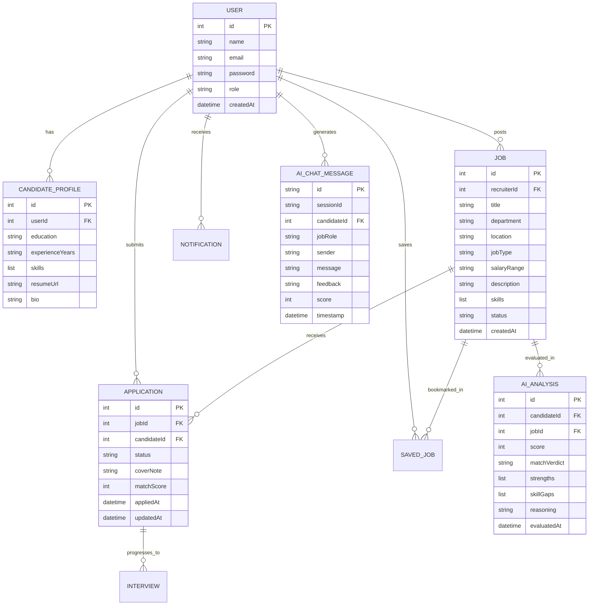
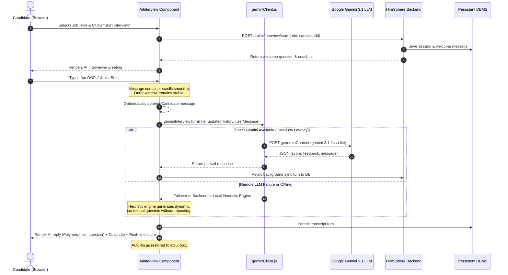
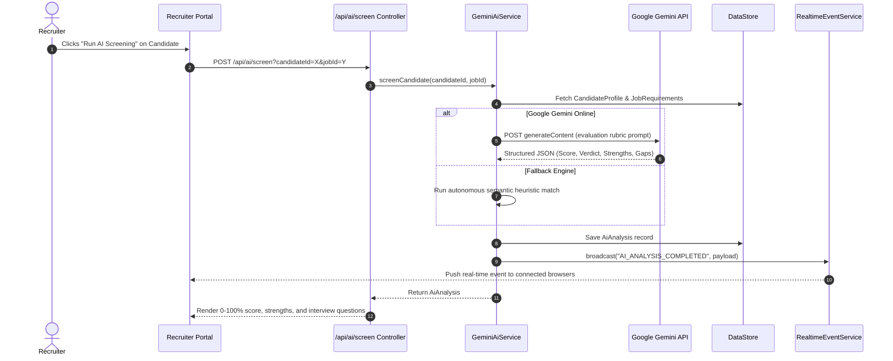
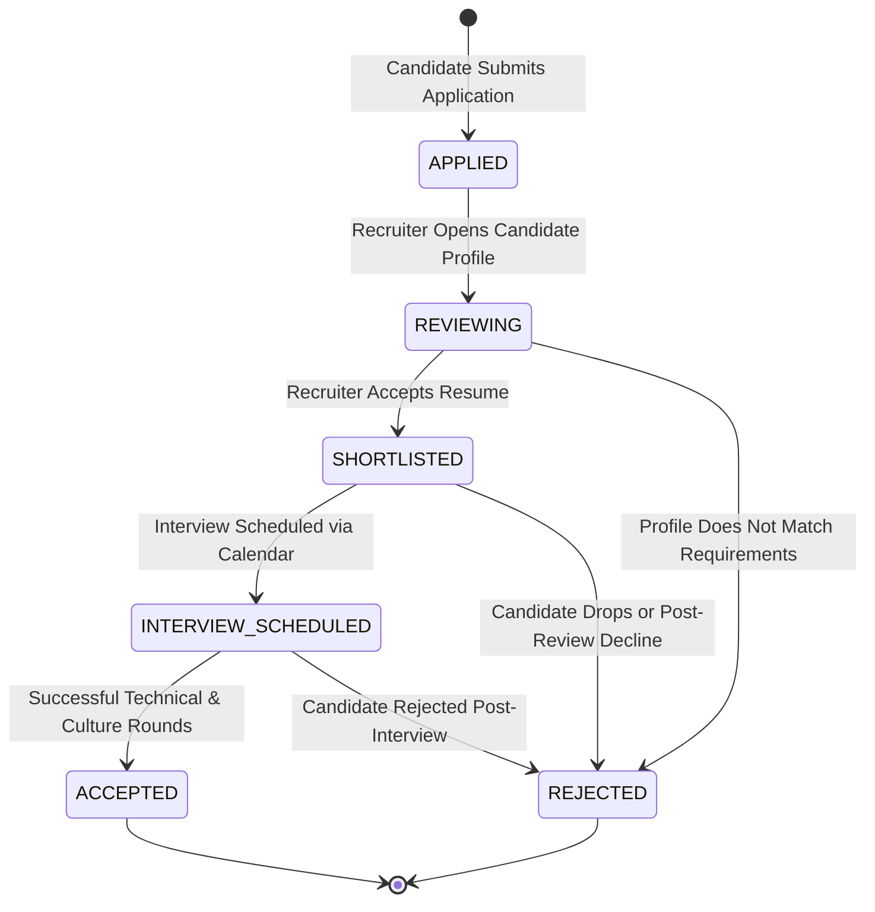
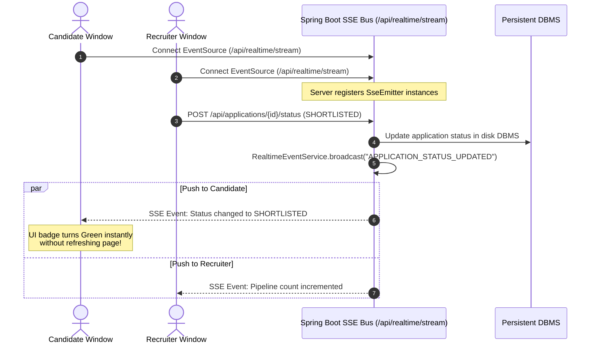
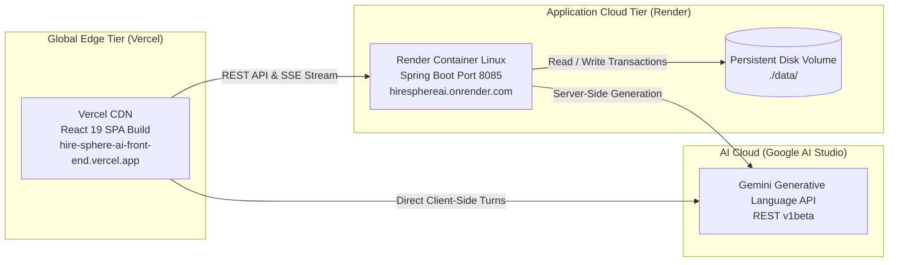

# HireSphere AI &mdash; System Architecture & Workflow Specification

This document details the architectural topology, component interactions, data model, state machines, and execution workflows of the **HireSphere AI Platform**.

---

## 1. High-Level System Architecture

HireSphere AI utilizes a decoupled, modern multi-tier architecture featuring a **Vite + React SPA**, an **Enterprise Spring Boot REST API**, a **Disk-Persistent Hybrid DBMS Engine**, and an **Autonomous Agentic AI Subsystem** powered by Google Gemini with local heuristic failover.

```mermaid
graph TD
    subgraph ClientLayer ["Client Layer (Web Browsers)"]
        A[React 19 SPA<br/>Vite 8, Context API]
        SSE_Client[EventSource SSE Client]
    end

    subgraph GatewayAndService ["Application & Service Tier (Spring Boot 3.2.5)"]
        REST[REST API Controllers<br/>/api/*]
        AuthService[Auth & User Service]
        JobService[Job Management Service]
        AppService[Application Workflow Engine]
        SSE_Bus[RealtimeEventService<br/>SSE Broadcaster]
        AiService[GeminiAiService<br/>Autonomous Agentic Engine]
    end

    subgraph DataTier ["Persistence Tier (DBMS)"]
        H2[(Persistent H2 DBMS<br/>data/hiresphere_realtime_db)]
        JSON_DB[(JSON Snapshot Engine<br/>hiresphere_realtime_db.json)]
    end

    subgraph ExternalAI ["External AI Infrastructure"]
        Gemini[Google Gemini API v1beta<br/>Models: gemini-3.1-flash-lite / 3.5]
    end

    A -->|HTTPS REST Queries| REST
    SSE_Client <==|Persistent SSE Stream<br/>/api/realtime/stream| SSE_Bus
    REST --> AuthService
    REST --> JobService
    REST --> AppService
    REST --> AiService

    AppService -->|Broadcast Mutations| SSE_Bus
    AuthService --> DataStore[DataStore Facade]
    JobService --> DataStore
    AppService --> DataStore
    AiService --> DataStore

    DataStore --> H2
    DataStore --> JSON_DB

    AiService -->|Primary LLM Turns| Gemini
    A -.->|Client-Side Direct Low-Latency AI| Gemini
```

---

## 2. Component Architecture Breakdown

### 2.1 Frontend Component Architecture (`frontend/src`)
- **Routing & State:** `App.jsx` handles client-side routing via React Router DOM.
- **Context Providers:**
  - `AuthContext.jsx`: Manages user credentials, active roles (`CANDIDATE`, `RECRUITER`, `ADMIN`), and localStorage tokens.
  - `RealtimeContext.jsx`: Maintains persistent connection to `/api/realtime/stream` using HTML5 `EventSource`, dynamically updating application and notification state across all pages.
- **Service Layer (`services/`):**
  - `aiService.js`: High-level AI coordinator. Routes interview turns and candidate screening requests to direct Gemini client or backend with automatic failover.
  - `geminiClient.js`: Direct client-side SDK for Google Gemini models (`gemini-3.1-flash-lite`, `gemini-3.5-flash-lite`) featuring built-in exponential backoff, JSON extraction, and STAR rubric generation.
  - `jobService.js`, `applicationService.js`: Standard REST abstraction layers over `axiosClient.js`.
- **View Layer (`pages/`):**
  - `AiInterview.jsx`: Turn-by-turn conversational mock interview chamber with isolated container-only scrolling, instant scoring, and live feedback.
  - `Jobs.jsx`, `JobDetails.jsx`: Job browsing and filtering.
  - `PostJob.jsx`: Recruiter vacancy creation with 1-click AI description generator.
  - `Applications.jsx`: Interactive recruitment pipeline tracker.

### 2.2 Backend Architecture (`backend/hiresphere-backend`)
- **Controllers (`com.hiresphere.controller`):**
  - `AiController`: Exposes `/api/ai/screen`, `/api/ai/interview/start`, `/api/ai/interview/message`, and `/api/ai/generate-job`.
  - `JobController`, `ApplicationController`, `UserController`, `InterviewController`.
  - `RealtimeStreamController`: Emits text/event-stream chunks to connected clients.
- **AI Core (`com.hiresphere.ai`):**
  - `GeminiAiService`: Orchestrates prompt construction, HTTP client communication with Google Generative Language APIs, and autonomous local heuristic failover when offline.
- **Persistence Store (`com.hiresphere.store`):**
  - `DataStore`: Thread-safe, disk-persistent in-memory and file store backing all entities without cloud dependency.

---

## 3. Entity Relationship Diagram (ERD)



---

## 4. Key Workflows & Sequence Diagrams

### 4.1 Interactive AI Mock Interview & Coaching Flow
This sequence demonstrates the turn-by-turn conversational mock interview with dynamic topic adaptation (e.g. candidate specifying "OOPs"):



---

### 4.2 Autonomous Candidate Screening Workflow (`/api/ai/screen`)
Demonstrates how candidates are evaluated against job requirements autonomously:



---

### 4.3 Real-Time Application Pipeline State Machine
Illustrates how an application moves through hiring stages and notifies candidates instantly:



---

### 4.4 Real-Time Event Synchronization Architecture (SSE Bus)
Demonstrates multi-client synchronization without polling:



---

## 5. Resilience & Multi-Tier AI Failover Matrix

To ensure the platform operates uninterrupted with a 100% uptime guarantee, HireSphere AI implements a 3-tier cascade:

| Tier | Engine | Protocol | Latency | Capability |
| :--- | :--- | :--- | :--- | :--- |
| **Tier 1** | Client-Side Direct Gemini | HTTPS to Google API (`gemini-3.1-flash-lite`) | ~1.2s - 2.0s | Real-time reasoning, dynamic follow-ups, contextual STAR tips, full topic adaptation. |
| **Tier 2** | Backend Server Gemini | Spring Boot `RestTemplate` to Gemini Endpoint | ~1.5s - 2.5s | Server-authenticated execution with persistent database logging and SSE event broadcast. |
| **Tier 3** | Local Autonomous Engine | In-Memory Heuristic Rule Engine | < 50ms | Topic-aware, progressive non-repeating technical questions and scoring for 100% offline environments. |

---

## 6. Deployment & Physical Topology


